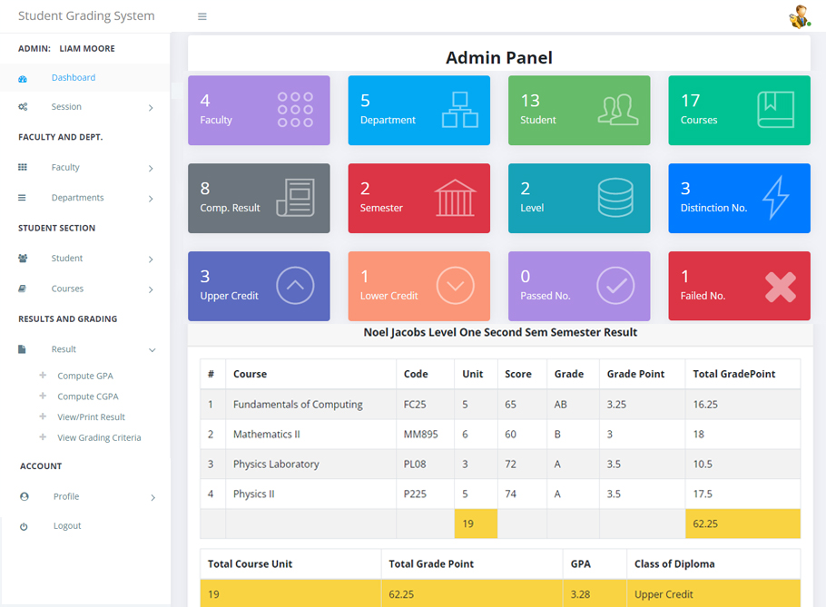

## - 👨‍💻  Aspiring Data Scientist 
## - 🌍  I'm based in Bangladesh
## - ✉️  You can reach me by [email](mailto:zami35-708@diu.edu.bd)

## Education
- S.S.C. | Savar Adhar Chandra Government High School (_2018_) | GPA- 4.50								       		
- H.S.C. | Savar Laboratory College (_2020_) | GPA- 4.50	 			        		
- B.Sc. | Department of Software Engineering | Daffodil International University

## Skill

## Project
### Student Grading System

This project was made using Java Swing GUI and SQL database. We used a letter grading system (A, B, C, D, F) with corresponding grade points. Each course is worth a certain number of credits. GPA is calculated by averaging the grade points earned, weighted by credits. Higher grades and more credits lead to a higher GPA.

## My Socials

